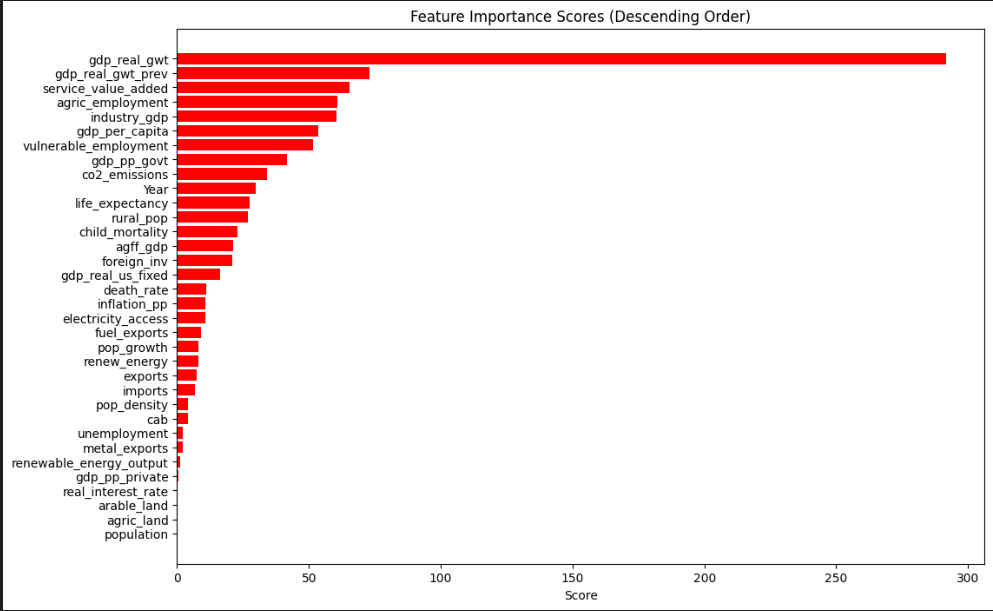
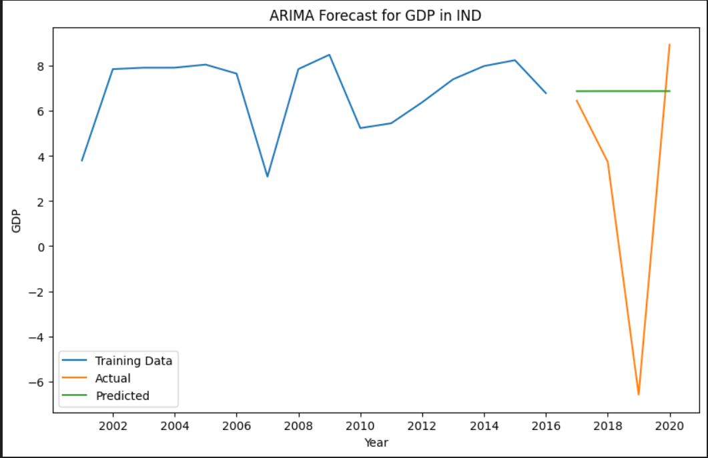

# GDP Forecasting Project

## Introduction
This project aims to forecast the Gross Domestic Product (GDP) for different countries using historical economic data. Time series forecasting techniques, specifically the ARIMA model, are employed to predict future GDP values based on past trends. This analysis helps in understanding economic trends and making informed decisions for economic planning and policy-making.

## Steps
1. **Data Preprocessing**:
   - Load the dataset containing various economic indicators.
   - Filter the data for a specific country.
   - Convert the 'Year' column to datetime format and set it as the index.

2. **Train-Test Split**:
   - Split the data into training (80%) and testing (20%) sets to evaluate the model's performance.

3. **Model Selection and Fitting**:
   - Use the ARIMA model to fit the training data. The model parameters (p, d, q) are selected based on initial analysis and optimization.

4. **Forecasting**:
   - Generate forecasts for the test period using the fitted ARIMA model.

5. **Evaluation**:
   - Evaluate the model's performance using metrics such as Mean Absolute Error (MAE), Mean Squared Error (MSE), Root Mean Squared Error (RMSE), Mean Absolute Percentage Error (MAPE), and Symmetric Mean Absolute Percentage Error (sMAPE).

6. **Visualization**:
   - Create plots to visualize the actual vs. predicted GDP values and key economic indicators.

   The following plot visualizes the key economic indicators on the basis of decreasing scores:



## Working
The project is implemented using Python with libraries such as pandas, numpy, sklearn, statsmodels, and matplotlib. Below is an example function for forecasting GDP for a specific country:

```python
def forecast_gdp_by_country(data, country_name):
    # Filter data for the specified country
    country_data = data[data['ISO3'] == country_name]
    
    # Convert 'Year' to datetime format and set it as index
    country_data['Year'] = pd.to_datetime(country_data['Year'], format='%Y')
    country_data.set_index('Year', inplace=True)
    
    # Splitting the data into train and test sets
    train_data = country_data.iloc[:int(0.8*len(country_data))]
    test_data = country_data.iloc[int(0.8*len(country_data)):]

    # Fit the ARIMA model
    model = ARIMA(train_data['gdp_real_gwt_next'], order=(1, 1, 1))
    arima_model = model.fit()

    # Forecast
    forecast = arima_model.forecast(steps=len(test_data))

    # Visualize actual vs predicted values
    plt.figure(figsize=(10, 6))
    plt.plot(train_data.index, train_data['gdp_real_gwt_next'], label='Training Data')
    plt.plot(test_data.index, test_data['gdp_real_gwt_next'], label='Actual')
    plt.plot(test_data.index, forecast, label='Predicted')
    plt.title(f'ARIMA Forecast for GDP in {country_name}')
    plt.xlabel('Year')
    plt.ylabel('GDP')
    plt.legend()
    plt.show()
```



## References

1. [https://machinelearningmastery.com/arima-for-time-series-forecasting-with-python/](https://machinelearningmastery.com/arima-for-time-series-forecasting-with-python/)
2. [https://www.geeksforgeeks.org/python-arima-model-for-time-series-forecasting/](https://www.geeksforgeeks.org/python-arima-model-for-time-series-forecasting/)
